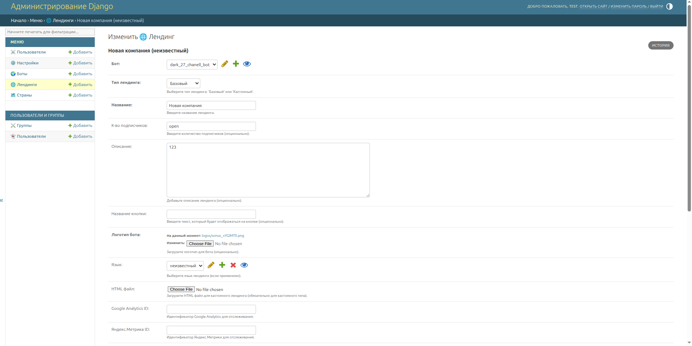
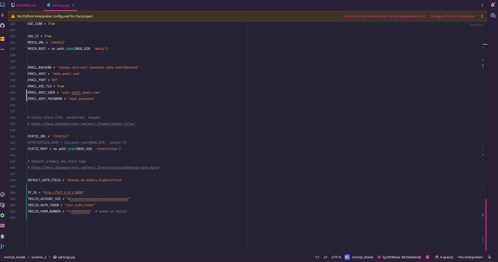

# Aurenora — Быстрый старт

Этот документ — короткий, практичный README для локального развертывания **лендинга** и функций рассылок (Telegram / Email / SMS).

---

## 1) Вход в админку

- Откройте: `http://127.0.0.1:8000/admin/`  
- Логин: `test`  
- Пароль: `test`

> Если таких пользователей нет, создайте суперпользователя:
```bash
python manage.py createsuperuser
```
или временно установите тестовые креды в админке.

---

## 2) Добавление бота


В админке создайте **Bot** (`CyberXXBot`):
- **name** — любое имя.
- **username** — **юзернейм из BotFather** (без `@`).
- **api_key** — токен бота из BotFather.
- **base_url** — базовая ссылка на ваш WebApp / продукт (можно указать любую валидную ссылку).
Сохраните. Убедитесь, что бот активен proces_id.

---

## 3) Страница лендинга



Создайте **LandingPage** для бота:
- **bot** — ваш бот.
- **landing_type** — выберите *basic* (базовый) или *custom*.
- **name**, **button_text**, **description** — по желанию.
- **language** — выберите страну пользователя **или** универсальную страну `XX` (для неизвестных).


### Как открыть лендинг
Маршрут:
```
path("lending/<str:username>/", LandingPageView.as_view(), name="lending_page")
```
Откройте в браузере:
```
http://127.0.0.1:8000/lending/<username>/
```
Где `<username>` — **username бота** (точно как в админке, без `@`).

> Лендинг автоматически подбирается по стране пользователя (определение по IP в рантайме). Если подходящей страницы под конкретную страну нет — используется fallback (например, с кодом `XX`).

---

## 4) Сохранение профиля пользователя (POST /save_profile_data)

Когда пользователь проходит по лендингу и продолжает в Telegram, фронтенд или ваш бот вызывает:
```
POST /save_profile_data
```
Параметры (form-data):
- `node_id` — username бота
- `telegram_user_id` — id пользователя в Telegram
- `full_name`, `username`, `telegram_language` — опционально
- `is_active_in_telegram` — `true`/`false`
- `email`, `phone` — опционально

Сервер:
- Определяет `ip`, `user_agent`.
- Находит `country/city/timezone` по IP.
- `get_or_create` `UserProfile` по `(telegram_user_id, node_id, bot)`.
- Сохраняет `country`, `ip_address`, `user_agent`, `city`, `timezone` и остальные поля.

После этого профиль виден в админке (раздел **Пользователи**), откуда можно запускать рассылки.

---

## 5) Рассылки (Telegram / Email / SMS)

В админке (или через API) можно запускать рассылки по **странам**. Поддерживается:
- **Telegram** — текст, кнопка, опционально медиа (фото/видео/документ). Для реальной отправки нужен доступный сервер. Сейчас по умолчанию используется заглушка/дефолт.
- **Email** — используйте настройки SMTP.
- **SMS** — через Twilio.

> Медиа в Telegram: при продакшн-развертывании убедитесь, что `media_url` доступен извне, иначе клиенты Telegram не смогут забрать файл.

---

## 6) Настройки (settings.py)

Укажите свои креды для почты и SMS:



```python
# Email (SMTP)
EMAIL_HOST = "smtp.example.com"
EMAIL_PORT = 587
EMAIL_HOST_USER = "your_user"
EMAIL_HOST_PASSWORD = "your_password"
EMAIL_USE_TLS = True  # или False — зависит от провайдера

# Twilio (SMS)
TWILIO_ACCOUNT_SID = "ACxxxxxxxxxxxxxxxxxxxxxxxxxxxxxxx"
TWILIO_AUTH_TOKEN = "your_auth_token"
TWILIO_FROM_NUMBER = "+1XXXXXXXXXX"  # номер из Twilio
```

Рекомендуем хранить секреты в переменных окружения.

---

## 7) Установка и запуск

```bash
# 1) Установить зависимости
pip install -r requirements.txt

# 2) Применить миграции
python manage.py migrate

# 3) (опционально) создать суперпользователя
python manage.py createsuperuser

# 4) Запуск дев-сервера
python manage.py runserver 
```


---

## 8) Полезные заметки

- **Страна `XX`** — универсальный fallback (Unknown). Создавайте лендинг с кодом `XX`, чтобы покрыть всех неизвестных.
- Лендинг **не сохраняет** профиль; сохранение профиля происходит в `save_profile_data` при наличии `telegram_user_id`.
- Для корректной массовой отправки медиа в Telegram используйте реальный публичный хостинг для файлов.

---

## 9) Технические эндпоинты 

- `GET /lending/<username>/` — отдает лендинг по боту
- `POST /save_profile_data` — сохраняет/обновляет `UserProfile`

## 10) установка проект а
```bash
python manage.py createsuperuser
```